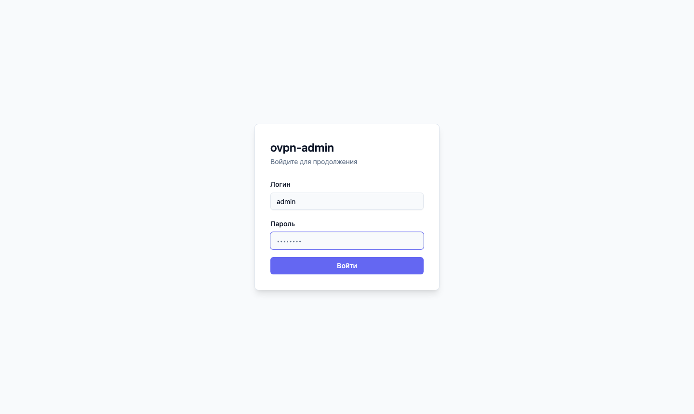
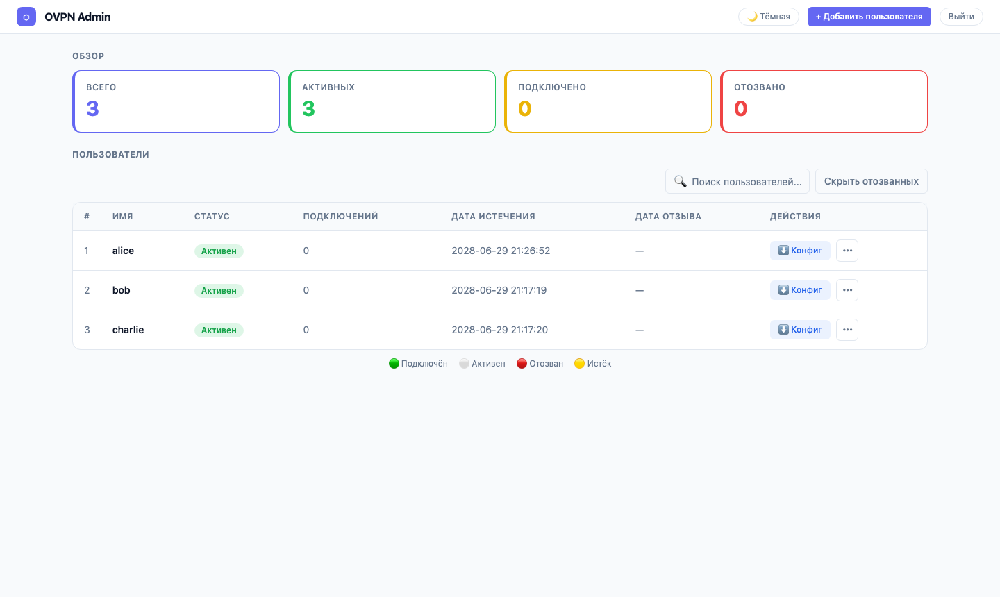
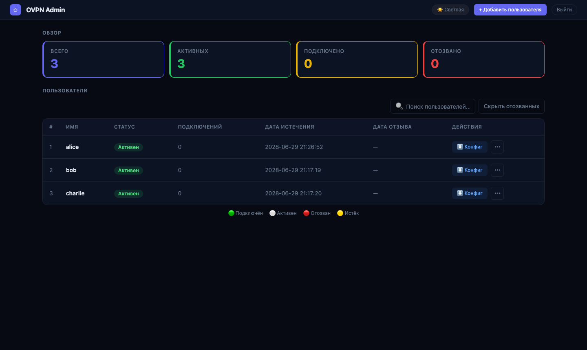

# ovpn-admin

[](https://github.com/VorkerJ/ovpn-admin/actions/workflows/ci.yml)
[](https://github.com/VorkerJ/ovpn-admin/releases)
[](https://github.com/VorkerJ/ovpn-admin/pkgs/container/ovpn-admin%2Fovpn-admin)
[](https://go.dev/)
[](LICENSE)

Simple web UI to manage OpenVPN users, their certificates & routes in Kubernetes. Backend is written in Go, frontend is built with Vue 3 + Tailwind CSS.

## Features

* **Web UI authentication** — htpasswd-based login with bcrypt passwords; supports multiple admin users; auto-generates a random password on first start if no htpasswd file is provided
* Adding, deleting OpenVPN users (generating certificates for them)
* Revoking / restoring / rotating user certificates
* Generating ready-to-use `.ovpn` config files
* Providing metrics for Prometheus, including certificate expiration dates, number of connected/total users, and per-user connection info
* (optionally) Specifying CCD (`client-config-dir`) per user — static IP address and custom push routes with IP validation
* (optionally) Operating in master/slave mode (syncing certs & CCD with another server)
* (optionally) Specifying/changing password for additional OpenVPN auth
* (optionally) Specifying a Kubernetes LoadBalancer in front of the OpenVPN server (auto-defined `remote` in `client.conf.tpl`)
* (optionally) Storing certificates and other files in Kubernetes Secrets

## Screenshots

Login page:



Managing users (light theme):



Managing users (dark theme):



## Installation

### Helm (Kubernetes) — recommended

```bash
helm repo add ovpn-admin https://VorkerJ.github.io/ovpn-admin
helm repo update
helm upgrade --install ovpn-admin ovpn-admin/openvpn-admin \
  --namespace vpn --create-namespace
```

See [charts/openvpn-admin/values.yaml](charts/openvpn-admin/values.yaml) for all available options.

### Docker (quick start)

```bash
git clone https://github.com/VorkerJ/ovpn-admin.git
cd ovpn-admin
docker compose up -d
```

The admin password is auto-generated on first start. Check the logs:

```bash
docker compose logs ovpn-admin | grep "Временный пароль"
```

### Building from source

Requirements: Go 1.25+, packr2, Node.js 20+

```bash
git clone https://github.com/VorkerJ/ovpn-admin.git
cd ovpn-admin
cd frontend && npm install && npm run build && cd ..
packr2
go build -o ovpn-admin
./ovpn-admin
```

## Authentication

ovpn-admin uses **htpasswd** (Apache format with bcrypt) for admin UI authentication.

**If `ADMIN_HTPASSWD_FILE` is not set**, a random 16-character password is generated at startup and printed to the log:

```
level=warning msg="ADMIN_HTPASSWD_FILE не задан. Временный пароль для admin: XxXxXxXxXxXxXxXx"
```

**To set a permanent password:**

```bash
# Create htpasswd file (add -B for bcrypt)
htpasswd -c -B ./htpasswd admin
# Add more users if needed
htpasswd -B ./htpasswd ops_user

# Pass to the app
export ADMIN_HTPASSWD_FILE=/path/to/htpasswd
```

**In Kubernetes**, store as a Secret:

```bash
kubectl create secret generic ovpn-admin-ui-auth \
  --from-file=htpasswd=./htpasswd -n <namespace>
```

Then in your `values.yaml`:

```yaml
ovpnAdmin:
  adminHtpasswdSecret: "ovpn-admin-ui-auth"
```

Sessions are signed with HMAC-SHA256 and expire after 12 hours. Logout immediately revokes the token server-side.

## Usage

```
usage: ovpn-admin [<flags>]

Flags:
  --listen.host="0.0.0.0"      host for ovpn-admin
  (or OVPN_LISTEN_HOST)

  --listen.port="8080"         port for ovpn-admin
  (or OVPN_LISTEN_PORT)

  --listen.base-url="/"        base URL for ovpn-admin web files
  (or OVPN_LISTEN_BASE_URL)

  --role="master"              server role, master or slave
  (or OVPN_ROLE)

  --master.host="http://127.0.0.1"
  (or OVPN_MASTER_HOST)        URL for the master server

  --master.basic-auth.user=""
  (or OVPN_MASTER_USER)        user for master server's Basic Auth

  --master.basic-auth.password=""
  (or OVPN_MASTER_PASSWORD)    password for master server's Basic Auth

  --master.sync-frequency=600
  (or OVPN_MASTER_SYNC_FREQUENCY)  master host data sync frequency in seconds

  --master.sync-token=TOKEN
  (or OVPN_MASTER_TOKEN)       master host data sync security token

  --ovpn.network="172.16.100.0/24"
  (or OVPN_NETWORK)            NETWORK/MASK_PREFIX for OpenVPN server

  --ovpn.server=HOST:PORT:PROTOCOL
  (or OVPN_SERVER)             HOST:PORT:PROTOCOL for OpenVPN server (repeatable)

  --ovpn.server.behindLB
  (or OVPN_LB)                 enable if OpenVPN is behind a K8s LoadBalancer Service

  --ovpn.service="openvpn-external"
  (or OVPN_LB_SERVICE)         name of the K8s LoadBalancer Service (repeatable)

  --mgmt=main=127.0.0.1:8989
  (or OVPN_MGMT)               ALIAS=HOST:PORT for OpenVPN mgmt interface (repeatable)

  --metrics.path="/metrics"
  (or OVPN_METRICS_PATH)       URL path for Prometheus metrics

  --easyrsa.path="./easyrsa"
  (or EASYRSA_PATH)            path to easyrsa dir

  --easyrsa.index-path=""
  (or OVPN_INDEX_PATH)         path to easyrsa index file

  --easyrsa.bin-path="easyrsa"
  (or EASYRSA_BIN_PATH)        path to easyrsa binary

  --ccd
  (or OVPN_CCD)                enable client-config-dir

  --ccd.path="./ccd"
  (or OVPN_CCD_PATH)           path to client-config-dir

  --templates.clientconfig-path=""
  (or OVPN_TEMPLATES_CC_PATH)  path to custom client.conf.tpl

  --templates.ccd-path=""
  (or OVPN_TEMPLATES_CCD_PATH) path to custom ccd.tpl

  --auth.password
  (or OVPN_AUTH)               enable per-user OpenVPN password authentication

  --auth.db="./easyrsa/pki/users.db"
  (or OVPN_AUTH_DB_PATH)       database path for password authentication

  --auth.db-init
  (or OVPN_AUTH_DB_INIT)       initialize auth DB if missing or empty

  --admin.htpasswd-file=""
  (or ADMIN_HTPASSWD_FILE)     path to htpasswd file for admin UI; if empty, a random password is generated

  --storage.backend="filesystem"
  (or STORAGE_BACKEND)         storage backend: filesystem or kubernetes.secrets

  --client-cert.expiration-days=3650
  (or CLIENT_CERT_EXPIRATION_DAYS)  client certificate validity in days

  --log.level="info"
  (or LOG_LEVEL)               log level: trace, debug, info, warn, error

  --log.format="text"
  (or LOG_FORMAT)              log format: text or json
```

## Notes

* This tool uses external calls to `bash`, `coreutils`, and `easy-rsa` — **Linux only**.
* For per-user OpenVPN password auth, install [openvpn-user](https://github.com/pashcovich/openvpn-user/releases/latest) and pass `--auth.password`.
* When using `--ccd`, set `--ovpn.network` to match your OpenVPN server network.
* Master/slave sync and per-user password auth do not work with `--storage.backend=kubernetes.secrets`.
* Connected user status refreshes every 28 seconds.

## Authors

ovpn-admin was originally created in [Flant](https://github.com/flant/) and used internally for years.

In March 2021 it [went public](https://medium.com/flant-com/introducing-ovpn-admin-a-web-interface-to-manage-openvpn-users-d81705ad8f23). [@vitaliy-sn](https://github.com/vitaliy-sn) created its first version in Python; [@pashcovich](https://github.com/pashcovich) rewrote it in Go.

In November 2024 the project moved to [Palark](https://github.com/palark/).

This fork is maintained by [@VorkerJ](https://github.com/VorkerJ) with added authentication support and Kubernetes-native PKI storage.
