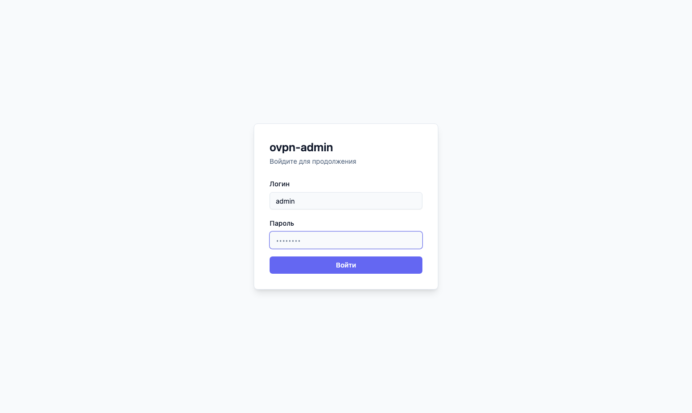
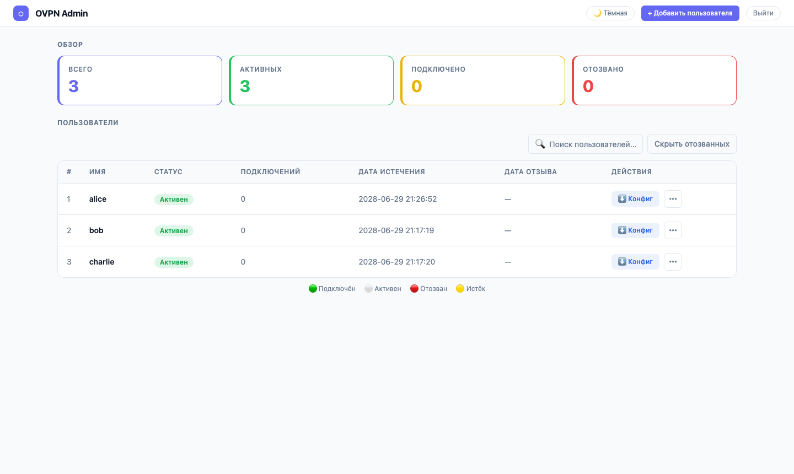
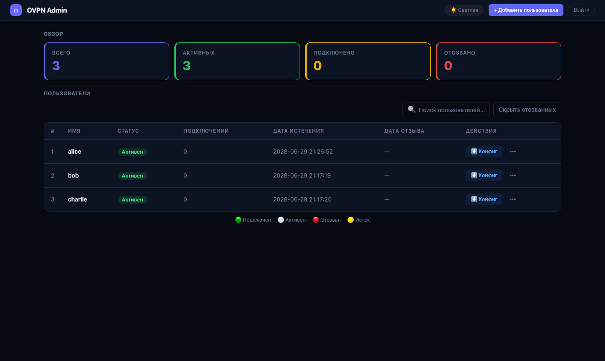

# ovpn-admin

[](https://claude.ai)
[](https://github.com/VorkerJ/ovpn-admin/actions/workflows/ci.yml)
[](https://github.com/VorkerJ/ovpn-admin/releases)
[](https://github.com/VorkerJ/ovpn-admin/pkgs/container/ovpn-admin%2Fovpn-admin)
[](https://go.dev/)
[](LICENSE)

Simple web UI to manage OpenVPN users, their certificates & routes in Kubernetes. Backend is written in Go, frontend is built with Vue 3 + Tailwind CSS.

## Features

* **Web UI authentication** — htpasswd-based login with bcrypt passwords; supports multiple admin users; auto-generates a random password on first start if no htpasswd file is provided
* **TOTP (2FA) for the admin UI** — RFC-6238 with 8 backup codes; can be enforced as a gate on every write endpoint via `OVPN_MFA_REQUIRED`
* Adding, deleting OpenVPN users (generating certificates for them)
* Revoking / restoring / rotating user certificates
* Generating ready-to-use `.ovpn` config files
* Providing metrics for Prometheus, including certificate expiration dates, number of connected/total users, and per-user connection info
* **Per-user CCD** (`client-config-dir`) — static IP, custom push routes (by IP/mask or domain with automatic DNS refresh), bulk import from text/file
* **Per-user full-tunnel with LAN exclusions** — a "Полный туннель" toggle per user that pushes `redirect-gateway def1` plus a configurable list of subnets that bypass the VPN (home LAN, work VPN, Docker bridges). Global defaults are merged with per-user extras. See [Per-user full-tunnel](#per-user-full-tunnel) below.
* **Common Routes** — a global list of push routes applied to every active user. Supports both static IP/mask entries and domain-based entries (the server periodically re-resolves and pushes the current IPs). Search, pagination, bulk import.
* **Per-user OpenVPN password auth** — an optional password *on top of* the client certificate, toggled from the **Server** tab and assigned per user in the UI (no env vars). Cert-only users connect unchanged and are never prompted; only flagged users must present a password. The `openvpn-user` verifier is built into the image (no third-party download).
* **Cumulative per-user traffic** — a **Traffic** tab showing how much each user has transferred, bucketed by calendar month (history kept) and persisted across reconnects and restarts.
* **Service-account API tokens** — long-lived, scope-limited tokens for non-interactive integrations (create/revoke users, manage per-user routes) — see [docs/API.md](docs/API.md).
* (optionally) Specifying a Kubernetes LoadBalancer in front of the OpenVPN server (auto-defined `remote` in `client.conf.tpl`)
* (optionally) Storing certificates and other files in Kubernetes Secrets
* **Server-side route enforcement** — when enabled (default in Helm), ovpn-admin installs per-client iptables rules so that each VPN client can only reach destinations explicitly allowed via per-user CCD routes or global Common Routes. Requires `NET_ADMIN` capability.
* **Editable server config** — proto, port, MTU, cipher, DCO, DNS push, custom directives через web UI без `helm upgrade`. Hybrid reload (SIGHUP soft / SIGTERM hard) с автоматическим rollback при невалидной конфигурации.
* **Auto-kick on policy change** — when a CCD or server-config edit affects what gets pushed to clients, ovpn-admin disconnects the affected sessions via the management interface so they reconnect and pick up the new directives immediately (no waiting for the operator to ping the user).

## Screenshots

Login page:



Managing users (light theme):



Managing users (dark theme):



## Installation

### Helm (Kubernetes) — recommended

```bash
helm repo add ovpn-admin https://VorkerJ.github.io/ovpn-admin
helm repo update
helm upgrade --install ovpn-admin ovpn-admin/openvpn-admin \
  --namespace vpn --create-namespace
```

See [charts/openvpn-admin/values.yaml](charts/openvpn-admin/values.yaml) for all available options.

### Docker (quick start)

```bash
git clone https://github.com/VorkerJ/ovpn-admin.git
cd ovpn-admin
docker compose up -d
```

The admin password is auto-generated on first start. Check the logs:

```bash
docker compose logs ovpn-admin | grep "Временный пароль"
```

By default the admin UI binds to `127.0.0.1:8080` on the host — it is **not** reachable from the network. See the next section for how to deploy on a public VPS.

### Deploy on a single VPS

Run everything on one Linux box (Ubuntu/Debian/Alma — anything with a recent kernel). The two containers from `docker-compose.yaml` are exactly the same images the Helm chart uses, so there's no second code path to maintain.

**Prerequisites**

- A VPS with a public IP, port `1194/udp` open (or the port you pick).
- Docker Engine ≥ 24 with the Compose plugin. On Ubuntu:
  ```bash
  curl -fsSL https://get.docker.com | sh
  ```
- DNS A-record pointing at the VPS (optional, but nicer than typing the IP).

**1. Clone and configure**

```bash
git clone https://github.com/VorkerJ/ovpn-admin.git
cd ovpn-admin
cp .env.example .env
```

Edit `.env` and set at minimum:

```env
OVPN_PUBLIC_HOSTNAME=vpn.example.com   # IP or DNS — goes into client .ovpn files
OVPN_PORT=1194
OVPN_PROTO=udp
OVPN_NETWORK_BASE=172.16.100.0          # don't collide with your LAN
```

All other variables have defaults; see `.env.example` for the full list.

**2. Start the stack**

```bash
docker compose build --no-cache
docker compose up -d
docker compose logs -f
```

The OpenVPN container handles its own iptables/NAT for the VPN subnet — just leave the firewall on the VPS at "allow `1194/udp`" and you're done.

**3. Reach the admin UI**

Admin UI is bound to `127.0.0.1:8080` inside the VPS for security. SSH-tunnel into it from your laptop:

```bash
ssh -L 8080:127.0.0.1:8080 user@vpn.example.com
# then open http://127.0.0.1:8080 in your browser
```

The first time you connect, ovpn-admin will ask for a username/password. With the default setup it generates a random temporary password at startup — grab it from the logs:

```bash
docker compose logs ovpn-admin | grep "Временный пароль"
```

If you'd rather have a stable password, mount your own htpasswd file — see the [Authentication](#authentication) section above.

If you ever want to expose the UI without SSH, put a TLS-terminating reverse proxy (Caddy, nginx, Traefik) in front of it, set `OVPN_ADMIN_BIND=0.0.0.0` in `.env`, and **definitely** pin the admin password via htpasswd. Don't expose port 8080 raw over the public internet — it's HTTP only.

**4. Add your first VPN client**

Open the admin UI, click *Создать* (Create), download the generated `.ovpn`, hand it to the user.

**Backups.** All state lives in `./easyrsa_master` (CA, keys, PKI) and `./ccd_master` (per-user routes). Snapshot those two directories — that's a full backup. For a production VPS, change `OVPN_EASYRSA_PATH` and `OVPN_CCD_PATH` to absolute paths under `/var/lib/ovpn-admin` and back them up from there.

**Upgrades.**
```bash
git pull
docker compose build --no-cache
docker compose up -d
```
`--no-cache` is required — the frontend is baked into the binary via packr2, and Docker's layer cache silently misses frontend changes.

### Building from source

Requirements: Go 1.25+, packr2, Node.js 20+

```bash
git clone https://github.com/VorkerJ/ovpn-admin.git
cd ovpn-admin
cd frontend && npm install && npm run build && cd ..
packr2
go build -o ovpn-admin
./ovpn-admin
```

## Authentication

ovpn-admin uses **htpasswd** (Apache format with bcrypt) for admin UI authentication.

**If `ADMIN_HTPASSWD_FILE` is not set**, a random 16-character password is generated at startup and printed to the log:

```
level=warning msg="ADMIN_HTPASSWD_FILE не задан. Временный пароль для admin: XxXxXxXxXxXxXxXx"
```

**To set a permanent password:**

```bash
# Create htpasswd file (add -B for bcrypt)
htpasswd -c -B ./htpasswd admin
# Add more users if needed
htpasswd -B ./htpasswd ops_user

# Pass to the app
export ADMIN_HTPASSWD_FILE=/path/to/htpasswd
```

**In Kubernetes**, store as a Secret:

```bash
kubectl create secret generic ovpn-admin-ui-auth \
  --from-file=htpasswd=./htpasswd -n <namespace>
```

Then in your `values.yaml`:

```yaml
ovpnAdmin:
  adminHtpasswdSecret: "ovpn-admin-ui-auth"
```

Sessions are signed with HMAC-SHA256 and expire after 12 hours. Logout immediately revokes the token server-side.

### Two-factor (TOTP)

Admins enable RFC-6238 2FA from the shield icon in the header (8 single-use backup codes). With `OVPN_MFA_REQUIRED=true` every write endpoint (and API-token / server-config management) is gated on a valid code for the session.

### Persistent auth state

The MFA enrollment, session signing key, logout blacklist, API tokens and traffic history live in the **state directory** (`--session.state-dir` / `OVPN_SESSION_STATE_DIR`). The shipped images default it to `/var/lib/ovpn-admin`; if unset and an htpasswd file is configured, it falls back to the htpasswd directory, otherwise `/tmp`. **Keep this on durable storage** (a PVC in Kubernetes, a bind mount or named volume in Docker) so 2FA and sessions survive container restarts.

Upgrading from an older build that stored this state next to the htpasswd file is seamless: on first start ovpn-admin copies the legacy files into the configured state directory (without overwriting), so MFA enrollment and sessions are preserved.

## Usage

```
usage: ovpn-admin [<flags>]

Flags:
  --listen.host="0.0.0.0"      host for ovpn-admin
  (or OVPN_LISTEN_HOST)

  --listen.port="8080"         port for ovpn-admin
  (or OVPN_LISTEN_PORT)

  --listen.base-url="/"        base URL for ovpn-admin web files
  (or OVPN_LISTEN_BASE_URL)

  --ovpn.network="172.16.100.0/24"
  (or OVPN_NETWORK)            NETWORK/MASK_PREFIX for OpenVPN server

  --ovpn.server=HOST:PORT:PROTOCOL
  (or OVPN_SERVER)             HOST:PORT:PROTOCOL for OpenVPN server (repeatable)

  --ovpn.server.behindLB
  (or OVPN_LB)                 enable if OpenVPN is behind a K8s LoadBalancer Service

  --ovpn.service="openvpn-external"
  (or OVPN_LB_SERVICE)         name of the K8s LoadBalancer Service (repeatable)

  --mgmt=main=127.0.0.1:8989
  (or OVPN_MGMT)               ALIAS=HOST:PORT for OpenVPN mgmt interface (repeatable)

  --metrics.path="/metrics"
  (or OVPN_METRICS_PATH)       URL path for Prometheus metrics

  --easyrsa.path="./easyrsa"
  (or EASYRSA_PATH)            path to easyrsa dir

  --easyrsa.index-path=""
  (or OVPN_INDEX_PATH)         path to easyrsa index file

  --easyrsa.bin-path="easyrsa"
  (or EASYRSA_BIN_PATH)        path to easyrsa binary

  --ccd
  (or OVPN_CCD)                enable client-config-dir

  --ccd.path="./ccd"
  (or OVPN_CCD_PATH)           path to client-config-dir

  --templates.clientconfig-path=""
  (or OVPN_TEMPLATES_CC_PATH)  path to custom client.conf.tpl

  --templates.ccd-path=""
  (or OVPN_TEMPLATES_CCD_PATH) path to custom ccd.tpl

  --auth.password
  (or OVPN_AUTH)               legacy global switch — forces OpenVPN password auth
                               ON for ALL users. For per-user control leave this
                               off and use the Server-tab "password auth" toggle.

  --auth.db="./easyrsa/pki/users.db"
  (or OVPN_AUTH_DB_PATH)       path to the password/2FA user DB (users.db)

  --auth.db-init
  (or OVPN_AUTH_DB_INIT)       initialize auth DB if missing or empty

  --session.state-dir=""
  (or OVPN_SESSION_STATE_DIR)  writable dir for MFA secrets, session signing key,
                               logout blacklist, API tokens and traffic history;
                               keep on durable storage. Defaults to the htpasswd
                               directory, else /tmp.

  --admin.htpasswd-file=""
  (or ADMIN_HTPASSWD_FILE)     path to htpasswd file for admin UI; if empty, a random password is generated

  --storage.backend="filesystem"
  (or STORAGE_BACKEND)         storage backend: filesystem or kubernetes.secrets

  --client-cert.expiration-days=3650
  (or CLIENT_CERT_EXPIRATION_DAYS)  client certificate validity in days

  --log.level="info"
  (or LOG_LEVEL)               log level: trace, debug, info, warn, error

  --log.format="text"
  (or LOG_FORMAT)              log format: text or json
```

## Notes

* This tool uses external calls to `bash`, `coreutils`, and `easy-rsa` — **Linux only**.
* Per-user OpenVPN password auth is **built in** — the `openvpn-user` verifier ships inside the image (no third-party download). Enable it from the **Server** tab and assign a password per user in the UI; cert-only users are unaffected. `OVPN_AUTH=true` is the legacy switch that forces it on for everyone.
* Upgrading an existing deployment? See [docs/UPGRADE.md](docs/UPGRADE.md) (worked example: 2.0.19 → 2.0.35, including the automatic auth-state migration).
* When using `--ccd`, set `--ovpn.network` to match your OpenVPN server network.
* Per-user password auth does not work with `--storage.backend=kubernetes.secrets` (the password DB is a filesystem SQLite db).
* Connected user status refreshes every 28 seconds.

## Server-side route enforcement (firewall)

By default, OpenVPN push routes are only a recommendation to the client — a user can manually `ip route add` any subnet via the tun device and reach it through the VPN, regardless of what was pushed by the server.

ovpn-admin's firewall feature **enforces** the allowed routes server-side. For each connected client, ovpn-admin installs iptables rules in the `OVPN_FW` chain (jumped from `FORWARD`) that:

- ACCEPT traffic from the client's VPN IP to each CIDR allowed by their CCD `CustomRoutes` ∪ global Common Routes
- DROP everything else from the VPN subnet (catch-all default-deny)

Rules are updated in real-time:
- On client connect/disconnect (via OpenVPN management interface)
- When per-user CCD is edited
- When global Common Routes are added/edited/deleted
- When DNS-resolved IPs for a domain-based common route change

### Requirements

- `NET_ADMIN` capability on the ovpn-admin container (already in Helm chart and docker-compose.yaml when feature is enabled)
- `iptables` binary in the ovpn-admin image (already included)
- OpenVPN `server.conf` includes `management-client-auth` directive (set automatically by the Helm chart)
- Feature is **off by default in code** (`--firewall=false`), but **on by default in the Helm chart** for new installs

### Disabling

To keep the legacy behavior (push routes are advisory, no server-side enforcement), set in your `values.yaml`:

```yaml
ovpnAdmin:
  firewall:
    enabled: false
```

Or set `OVPN_FIREWALL=false` via env if running in compose.

### Limitations

- IPv4 only (no `ip6tables` support in v1)
- CIDR-level rules only (no per-port or per-protocol filtering in v1)
- **Docker Desktop on Mac/Windows cannot run the firewall end-to-end**: Docker Desktop's Linux VM does not load the `iptable_filter` / `nf_tables` kernel modules, so any iptables invocation from inside a container returns "Failed to initialize" / "table doesn't exist". The feature works correctly on real Linux hosts (CI runners, Kubernetes nodes). For local development you can still iterate on the Go code and run unit tests; full end-to-end smoke needs a Linux VM or actual cluster.

## Per-user full-tunnel

`redirect-gateway def1` (push **all** client traffic through the VPN) used to
be a single global server-config flag — either on for everyone or off. As of
v2.0.17 the flag also lives **per user**, with a configurable list of subnets
that bypass the tunnel so the user's local network (home router, NAS, printer,
work LAN) keeps working.

### How to use it

1. Open a user → **Настройки** → tab **Подключение** → check **Полный туннель**
2. Save. The user's CCD is re-rendered and the user is auto-kicked so the next
   reconnect picks up the new push directives — no `.ovpn` file regeneration.

### What gets pushed

For a user with full-tunnel on, ovpn-admin renders into the CCD:

```
push "redirect-gateway def1"
push "route 192.168.0.0 255.255.0.0 net_gateway"     # Default LAN
push "route 10.0.0.0 255.0.0.0 net_gateway"          # Private 10/8
push "route 172.16.0.0 255.240.0.0 net_gateway"      # Private 172.16/12 + Docker
push "route 169.254.0.0 255.255.0.0 net_gateway"     # Link-local / mDNS
# ...plus any per-user extras and the user's existing per-user/common routes
```

`net_gateway` is OpenVPN's keyword for "use the client's original default
gateway" — so traffic to these subnets stays on the LAN side instead of being
sent through the tunnel, even though `redirect-gateway def1` would otherwise
catch it.

### Two layers of exclusions

* **Global defaults** — managed in **Настройки сервера** → **Исключения для
  full-tunnel**. Ship out of the box with the four RFC1918 + link-local
  ranges above; the operator can add, edit, or remove them. Apply to every
  full-tunnel user.
* **Per-user extras** — managed in the user's settings modal under the
  **Исключения** tab. Layered on top of globals (deduped by `Address`/`Mask`).
  Useful for one-off cases (a particular user's corporate VPN subnet, a
  non-standard home network like `192.168.88.0/24` on MikroTik routers, etc.)
  without touching the global defaults.

### Upgrade safety

On upgrade from a pre-v2.0.17 version, `deserializeServerConfig` backfills the
default exclusions list if the field was missing from the saved JSON. This is
distinguished from "operator explicitly set an empty list" via a raw-JSON peek,
so a deliberately-cleared list is respected. Without this an operator's first
full-tunnel toggle after upgrade would silently kill home-LAN access for that
user.

### Validation

The `Subnet` type used in both layers rejects, at the API boundary:

* malformed or non-IPv4 addresses (IPv6 is not supported here)
* non-contiguous netmasks (`255.0.255.0`)
* addresses with host bits set under their mask (`192.168.0.5/16` →
  canonical form would be `192.168.0.0/16`; the operator probably typo'd)
* descriptions containing newlines, double quotes, NUL bytes, or longer
  than 200 chars — all CCD-injection vectors

## Editable server configuration

The admin UI exposes a "Сервер" tab where you can edit ~15 OpenVPN server
parameters at runtime: protocol (UDP/TCP), port, MTU, data ciphers, TLS
version, DCO (Data Channel Offload), DNS push, redirect-gateway, custom
directives, and more.

### How reload works

- **Soft fields** (DNS push, verb, keepalive, push directives, custom
  directives) — applied via SIGHUP to the running openvpn process. Existing
  clients stay connected; new pushed values take effect on their next
  reconnect.
- **Hard fields** (proto, port, MTU, ciphers, TLS mode, DCO, network) —
  openvpn process is restarted via SIGTERM. All clients drop for ~5 seconds.
  If the new config is invalid (openvpn fails to start within 15s),
  ovpn-admin automatically rolls back to the previous version.

### DCO (kernel offload)

DCO support requires the `ovpn` kernel module (Linux 6.16+) or the
out-of-tree `ovpn-dco` module. ovpn-admin auto-detects availability at
startup. On managed Kubernetes (EKS/GKE/AKS) without custom AMI, DCO is
typically not available — the UI shows a warning and disables the toggle.

## Authors

ovpn-admin was originally created in [Flant](https://github.com/flant/) and used internally for years.

In March 2021 it [went public](https://medium.com/flant-com/introducing-ovpn-admin-a-web-interface-to-manage-openvpn-users-d81705ad8f23). [@vitaliy-sn](https://github.com/vitaliy-sn) created its first version in Python; [@pashcovich](https://github.com/pashcovich) rewrote it in Go.

In November 2024 the project moved to [Palark](https://github.com/palark/).

This fork is maintained by [@VorkerJ](https://github.com/VorkerJ) with added authentication support and Kubernetes-native PKI storage.
